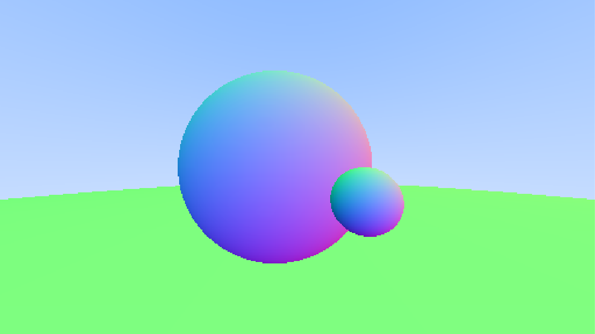

# 🌈 TinyRT: A Tiny Ray Tracer from Scratch

Tutorial: [Ray Tracing in one Weekend](https://raytracing.github.io/books/RayTracingInOneWeekend.html)


## 🖼️ Quick Start~

Build with [xmake](https://xmake.io/) (see `xmake.lua` for more configs),

```sh
# Clone this repo
git clone https://github.com/ReyChiaro/TinyRT.git

# cd to the project and build with xmake
xmake

# Then run and output
xmake run > outputs/spheres.ppm
```

Check the output, you will get something like this:


> Note that as a tiny project, we use `.ppm` as the image output format, which is extremely simple.

To add more cute spheres to the world, check the main function (`src/main.cpp`):

```cpp
auto world = hittable_list();

// sphere(<sphere_center>, <radius>)
world.add(std::make_shared<sphere>(point3d(-0.1, 0, -1), 0.5));
world.add(std::make_shared<sphere>(point3d(0.2, -0.1, -0.5), 0.1));
world.add(std::make_shared<sphere>(point3d(0, -100.5, -1), 100));
```

